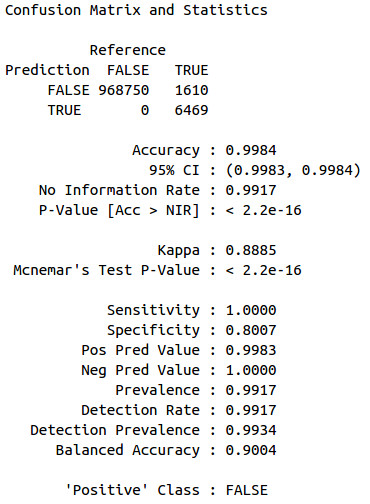
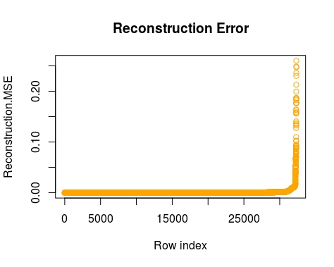
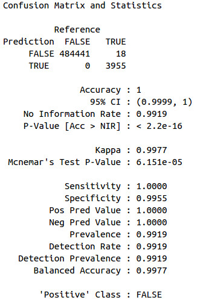

# Modelling one-class classifiers to thwart cyber-attacks in the IoT space
#### By Harsha Kumara Kalutarage, Bhargav Mitra and Robert McCausland
=======

The Internet of Things (IoT) refers to smart paraphernalia, sensor-embedded devices connected to the internet. An IoT device can be any thing from a home door-bell to an aeroplane. The digital age — we are in — is witnessing monstrous waves of such devices battering the consumer and business markets on a daily-basis and according to [Business Insider UK](http://uk.businessinsider.com/the-internet-of-things-2017-report-2018-2-26-1), there will be 55 billion of IoT-devices in use by 2025. The industry is also expecting a boom — $15 trillion in aggregate investment between 2017 – 2025.  These figures  bring to the picture the promise of profit-potential opportunities, they also carry the realistic threat of expansion of cyber-attack surface. A network of such devices — a BotNet —- can be compromised to cause service-outage or to steal information from your PC. The Distributed Denial-of-Service (DDoS) attack against Dyn Domain-Name-Server in 2016 that used a network of 100,000 odd IoT-devices, driven by a virus called [Mirai](https://medium.com/iotforall/huge-vulnerability-discovered-in-the-ring-doorbell-f42b492c4d5f) (Linux. Gafgyt), bear testimony to this account.

However, such attacks can be thwarted by analysing the web-traffic routed to an IoT-device.

In this post, we present how one-class classifiers — trained using benign data — can be modelled in [R](https://www.r-project.org/) to distinguish between normal and malicious traffic diverted to an IoT-device. The data for this exercise was obtained from the UCI Machine Learning Repository; link to the data can be found [here](https://archive.ics.uci.edu/ml/datasets/detection_of_IoT_botnet_attacks_N_BaIoT). In particular, the Danmini Doorbell (DDb) data in that repository was used to model the classifiers. It should be noted that we — as data-analytics practitioners — fully subscribe to the ‘cross industry standard process for data-mining [also read [The Team Data Science Process lifecycle](https://docs.microsoft.com/en-us/azure/machine-learning/team-data-science-process/lifecycle)]’ which recommends spending a significant proportion of a project time-line in comprehending the business operation and the data, and data pre-processing [read [Data acquisition and understanding](https://docs.microsoft.com/en-us/azure/machine-learning/team-data-science-process/lifecycle-data)] before initiating the process of modelling; however, in this analysis, it was assumed that the data is in a state ready for building a classification model. In other words, the focus of this article is on the modelling phase of any standard framework to apply data-analytics.

## Data description

The DDb dataset contains three types of web traffic data — benign traffic containing 40, 395 records, Mirai traffic containing 652,100 records and Gafgyt traffic containing 316,650 records. Each record contains 115 features which were generated by the publishers of the dataset using raw attributes of network traffic. As both Gafgyt and Mirai traffic produced by the attack activity, the two data-sources were combined to construct the overall set of malicious data (968,750 records) for this exercise. It can be argued that as the end-objective of a model — in this context — would be to allow benign traffic to pass to and from the device and discard transmission and reception of malicious data, a one-class classifier trained using benign data would adequately suit the purpose. We used 80% of the benign records to build our model. This means that 32, 316 records were used to train the model and (40,395 – 32,316) + (652,100 + 316,650) = 976,829 records were used to evaluate the performance of the model. From an alternative perspective, this is where ML in practice departs from conventional theory. In the theoretical space, the size of the test set — by custom — seldom exceeds the size of the training set; in reality, however, a practitioner may end up with a situation described in this post — the size of the training data is only 3.2% of the size of the overall data-set. We argue that if a model, trained using a small proportion of the available data, performs well when applied to the large test dataset, it reflects the model’s robustness for the application. It can be proposed as an alternative that the one-class classifier to be trained using attack-traffic (malicious) data. However, we do not recommend this approach as in the future, discovery of new exploits may change the statistical properties of the attack-traffic.

The code, written in R, is presented below. The R packages — readr, kernlab, caret and h20, will be employed in our analysis. We assume that you are using [RStudio](https://www.rstudio.com/) and would be downloading and installing above packages using Tools > Install Packages… > ‘package-name’ [Do check the Install dependencies box]

## Data preparation

Quality of input-data determines the quality of output of any ML algorithm. Therefore, understanding the data and the context, and cleaning and preparation of the data [for model construction] are critical steps that should be followed before initiating the process of modelling. However, in this post and as mentioned before, we assume that the data — after some basic cleaning — is ready for modelling; in other words, the scope of this post is limited to the demonstration of a mechanism to build one-class classifiers.

```R
library(readr) # provides a fast and friendly way to read csv data

# A function to load multiple .CSV files from a directory
loadData<-function(dirPath){ 
  fileList <- list.files(dirPath, pattern=".csv",full.names = TRUE)
  for (eachFile in fileList){
    if (!exists("tmpDataset")){
      tmpDataset <- read.csv(eachFile,header = T)
    } else if (exists("tmpDataset")){
      tempData <-read.csv(eachFile,header = T)
      tmpDataset<-rbind(tmpDataset, tempData)
    }}
  return(tmpDataset)
}

# Load the benign traffic data from the publisher location
benginDataset<- read_csv("https://archive.ics.uci.edu/ml/machine-learning-databases/00442/Danmini_Doorbell/bengin_traffic.csv")

# Download, .RARs that contain malicious traffic from the publisher location, extract and read data
devtools::install_github("jimhester/archive") # install archive package
library(archive)

temp_file1 <- tempfile(fileext = ".rar")
download.file("https://archive.ics.uci.edu/ml/machine-learning-databases/00442/Danmini_Doorbell/gafgyt_attacks.rar", temp_file1) # Load the gafgyt data
temp_file2 <- tempfile()
archive_extract(temp_file1, temp_file2)
gafgytDataset<-loadData(temp_file2)
unlink(temp_file1)
unlink(temp_file2)

temp_file1 <- tempfile(fileext = ".rar")
download.file("https://archive.ics.uci.edu/ml/machine-learning-databases/00442/Danmini_Doorbell/mirai_attacks.rar", temp_file1) # Load the mirai traffic data
temp_file2 <- tempfile()
archive_extract(temp_file1, temp_file2)
miraiDataset<-loadData(temp_file2)
unlink(temp_file1)
unlink(temp_file2)

# Removing records in the dataset that contain NAs
benginDataset<-benginDataset[complete.cases(benginDataset), ]
gafgytDataset<-gafgytDataset[complete.cases(gafgytDataset), ]
miraiDataset<-miraiDataset[complete.cases(miraiDataset), ]

# Adding labels to the data, benign traffic is marked as TRUE, and malicious traffic as FALSE
benginDataset$Type<-TRUE
gafgytDataset$Type<-FALSE
miraiDataset$Type<-FALSE

# Preparing the dataset, split at random the benign dataset into two subsets --- one with 80% of the instances for training, and another with the remaining 20%; the remaining 20% is merged with malicious instances for testing
index <- 1:nrow(benginDataset)
testIndex <- sample(index, trunc(length(index)*20/100))
testSetBen <- benginDataset[testIndex,] # Create the Benign class for testing
testSet <- rbind(gafgytDataset,miraiDataset,testSetBen) # Pool the benign test instances with malicious instances to create the final testing dataset
trainSet <- benginDataset[-testIndex,] # Create the training set, this set contains benign instances only
```
## Model-fitting

In many security problems, it is relatively easy to gather training instances of situations that represent benign behaviour rather than malicious behaviour. Collection of instances for the malicious class can be rather expensive or just impossible (for example, consider zero-days attacks). This can be due to various reasons including legal, ethical and privacy issues. However, one could always argue that malicious instances can be simulated first to build models as traditional two-class classifiers. But, as security is an ‘arms race’ between attackers and defenders, there is no way to guarantee that all malicious situations can be simulated. To cope with this problem, unsupervised / one-class based modelling approaches are recommended in this application domain. Note that this point-of-view is in line with the arguments presented for one-class classifiers in the introductory-section.

The idea here is to create the model only using benign instances, and then use the trained model to identify new/unknown instances of the traffic using statistical and machine-learning approaches. If the target-data is too different, according to some measurement, it is labelled as out-of-class. To this end and for the purpose of demonstration, we will show in this post how to spot-check one-class classifiers — belonging to different families --in terms of performance.

Two one-class classifiers and their corresponding families to be used in this exercise are as follows:

- [One Class Support Vector Machine](http://papers.nips.cc/paper/1723-support-vector-method-for-novelty-detection.pdf) from the typical ML family.

- [Autoencoder](https://web.stanford.edu/class/cs294a/sparseAutoencoder_2011new.pdf) from the deep learning family.

## Using One Class Support Vector Machine(OCSVM)
R code snippet for training the OCSVM
```R
library(kernlab)
fit <- ksvm(Type~., data=trainSet, type="one-svc", kernel="rbfdot", kpar="automatic")
print(fit) # To print model details
```
### Model evaluation (OCSVM)

The above model was then applied to the testSet, and the performance measured using a confusion-matrix. As demonstrated through the Confusion Matrix and other statistics, 99.85% accuracy can be achieved using the OCSVM and the initial feature set.

```R
library(caret)
predictions <- predict(fit, testSet[,1:(ncol(testSet)-1)], type="response") # make predictions
confusionMatrix(data=as.factor(predictions),reference=as.factor(testSet$Type)) # summarize the accuracy
```
Confusion Matrix: 


## Using Autoencoder as one-class classifier

Here we use a technique called “Bottleneck” training, designing a deep neural-network architecture imposing a bottleneck in the hidden layers, which forces to learn a compressed knowledge representation (encoding) for the dataset. If input features, in terms of their values, were independent of each other this compression and subsequent reconstruction would be a difficult task. However, if some sort of structure (i.e. linear/non-linear correlations) exists in the data, this structure can be learned and consequently leveraged when forcing the input through the network’s bottleneck. So, our hypothesis in this modelling task will be “benign instances have some sort of structure which is different from the structure of the malicious instances”, and this structure can be learned and modelled using an Autoencoder model.

### R code snippet for training the Autoencoder
```R
library(h2o) # We will use h2o package for running h2o’s deep learning via its REST API
#h2o.removeAll() # To remove previous connections, if any
h2o.init(nthreads = -1) # To use all cores
data<-trainSet[,-116] # Take a copy of training data without labels
trainH2o<-as.h2o(data, destination_frame="trainH2o.hex") # Convert data to h20 compatible format
```

*Building a deep autoencoder learning model using trainH2o, i.e. only using "benign" instances, and using “Bottleneck” training with random choice of number of hidden layers*

```R
train.IoT <- h2o.deeplearning(x = names(trainH2o), training_frame = trainH2o, activation = "Tanh", autoencoder = TRUE, hidden = c(50,2,50), l1 = 1e-4, epochs = 100, variable_importances=T, model_id = "train.IoT", reproducible = TRUE, ignore_const_cols = FALSE, seed = 123)
h2o.saveModel(train.IoT, path="train.IoT", force = TRUE) # Better to save the model as it may take time to train it – depends on the performance of your machine
train.IoT <- h2o.loadModel("./train.IoT/train.IoT") # load the model
train.IoT # To print model details
```

We will use Reconstruction.MSE (read mean-squared-error of reconstruction) of the Autoencoder model to define the decision function (threshold) for novelty detection: classifying new data as similar or different to the training set.
```R
train.anon = h2o.anomaly(train.IoT, trainH2o, per_feature=FALSE) # calculate MSE across training observations
head(train.anon) # Print a sample of MSE values
err <- as.data.frame(train.anon)
plot(sort(err[,1]), main='Reconstruction Error',xlab="Row index", ylab="Reconstruction.MSE",col="orange")
```
Error Plot: 


As we can see in the plot, the Autoencoder struggles from index ~32,200 onwards as the error count accelerates upwards. We can determine that the model recognizes patterns in the first 32,200 observations that it can’t see as easily in the last ~300. This information can be used to define the decision boundary for novelty detection assuming that last ~300 instances are outliers with respect to the rest of instances in the benign dataset. Hence we will define the decision boundary (threshold), in terms of Reconstruction.MSE, as 0.02 for the benign class.
```R
threshold<-0.02 # Define the threshold based on Reconstruction.MSE of training
```
## Model evaluation (Autoencoder)

The model was then applied to the testSet, and the performance measured using a confusion-matrix — As shown in the Confusion Matrix and other statistics (e.g. accuracy, sensitivity, specificity), ~100% accuracy can be achieved using the Autoencoder model.
```R
train.IoT <- h2o.loadModel("./train.IoT/train.IoT") # load the model
newtestSet<-testSet[sample(nrow(testSet), 976829 %/% 2), ] # Here we select randomly 50% records of test instances due to the memory limitation of our computer, this step not necessary if you have enough memory on your machine / or run this section multiple times, and summarise (average) the results to approximate the accuracy if your computer has low computationally resources
data<-newtestSet[,-116] # remove labels from the test data frame
testH2o<-as.h2o(data, destination_frame="trainH2o.hex") #convert data to h20 compatible
test.anon = h2o.anomaly(train.IoT,testH2o, per_feature=FALSE) # calculate MSE across observations
err <- as.data.frame(test.anon)
prediction <- err$Reconstruction.MSE<=threshold
confusionMatrix(data=as.factor(prediction),reference=as.factor(newtestSet$Type)) # summarize the accuracy
```
Confusion Matrix: 


## Some final insights

Two points here.

First, we see that in this experiment, there is a heavy imbalance among distinct classes in the test dataset — the ratio between malicious samples to benign samples is 1000:8.34. In such a scenario if a model (classifier) performs well on the much larger set, it will drive the accuracy figures towards 100%. But, this does not mean that the model performs satisfactorily on the much smaller set. Hence in scenarios like this (highly likely in the cyber-security domain), accuracy figures should be taken with a pinch-of-salt, and attention should be paid to the sensitivity and specificity figures. From this angle, it can be argued that the autoencoder outperforms the OCSVM in this analysis (spot checking of algorithms).

Second, the models built in this exercise are nor perpetual models of normality for the Danmini Doorbell traffic data. It should be borne in mind that within the IT-security context, we have to assume the condition of adversarial setting — both defenders as well as attackers would be improving their techniques over time. This means that both normal traffic and malicious traffic would change over time rendering our models obsolete. The fact that the models — built in this exercise — come with expiry-dates is part of the concept-drift phenomenon in Data-Science and Machine Learning. We hope to discuss these aspects of using Data Science and Machine learning for Cyber Security in a different post in the future.

---

**Keywords: IoT-security; one-class classifiers; autoencoders.**

**Citation requests**
<br/>
If you found this post and/or the R code snippet provided to be useful, please be kind enough to cite below article in your work: <br/> Kalutarage, H., Mitra, B., & McCausland, R. (2018). Modelling IoT Anomoly Detection. ITNow, 60(3), 44-45.

Also note that there is a citation request from the dataset publisher at https://archive.ics.uci.edu/ml/datasets/detection_of_IoT_botnet_attacks_N_BaIoT